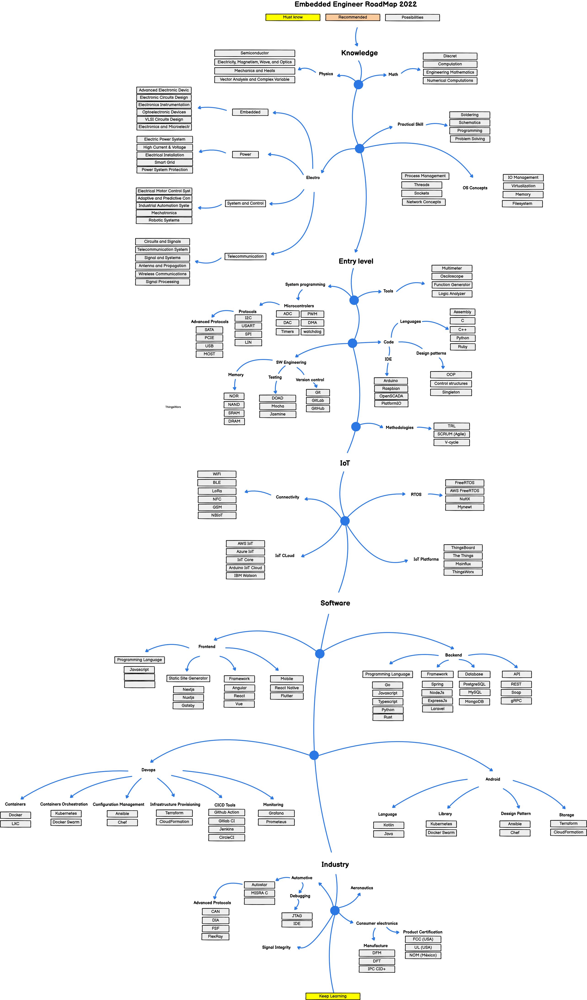

# **IoT Roadmap**

📜 This is my [**IoT Roadmap**](https://miro.com/app/board/uXjVOnZC-r8=/) create based on my work experience.

## **Roadmap**

## 🛠 **Details**

**Knowledge**

 |  Lecture | Resource |
| ------------ | ------------ |
|  Physics | https://www.youtube.com/playlist?list=PL6i60qoDQhQGaGbbg-4aSwXJvxOqO6o5e |
| Math  | https://www.youtube.com/playlist?list=PLB7540DEDD482705B |
| Electro  | https://www.youtube.com/playlist?list=PL9B24A6A9D5754E70 |
|  Practical Skills | https://www.qt.io/embedded-development-talk/essential-skills-for-embedded-systems-and-embedded-software-engineers  |
|  OS Concepts  | https://www.youtube.com/playlist?list=PLBlnK6fEyqRiVhbXDGLXDk_OQAeuVcp2O ||

**Entry Level**

|  Lecture | Resource |
| ------------ | ------------ |
|  System | Material Design, Jetpack Compose UI |
| Tools  | Broadcast Receivers, Services, Flavours |
| Code  | Media Player, Exo Player|
|  Software | Firebase, MySQL, Room, AWS ||

**IoT**

 |  Lecture | Resource |
| ------------ | ------------ |
|  Connectivity | Material Design, Jetpack Compose UI |
| RTOS  | Broadcast Receivers, Services, Flavours |
| IoT Cloud  | Media Player, Exo Player|
|  IoT Platform | Firebase, MySQL, Room, AWS ||

**Software**

 |  Lecture | Resource |
| ------------ | ------------ |
|  Frontend | Material Design, Jetpack Compose UI |
| Backend  | Broadcast Receivers, Services, Flavours |
| Devops  | Media Player, Exo Player|
|  Mobile | Firebase, MySQL, Room, AWS ||

**Advance**

 |  Lecture | Resource |
| ------------ | ------------ |
|  Machine Learning | Material Design, Jetpack Compose UI |
| Edge Computing  | Broadcast Receivers, Services, Flavours |
| Smart Cities  | Media Player, Exo Player ||

## 📈 **How To Guides**

Alguns exemplos interessantes e úteis sobre como seu projeto pode ser utilizado.

Adicione blocos de códigos e, se necessário, screenshots.

_Para mais exemplos, consulte a [Wiki](wiki)._ 

## 🚀 **Contribution**

1. Fork (https://github.com/ksatriow/my-iot-roadmap/fork)
2. Create new branch (`git checkout -b [fill with your branch]`)
3. Commit your changes (`git commit -am '[fill with your updated changes]'`)
4. Push it to your branch (`git push origin branch`)
5. Create Pull Request
